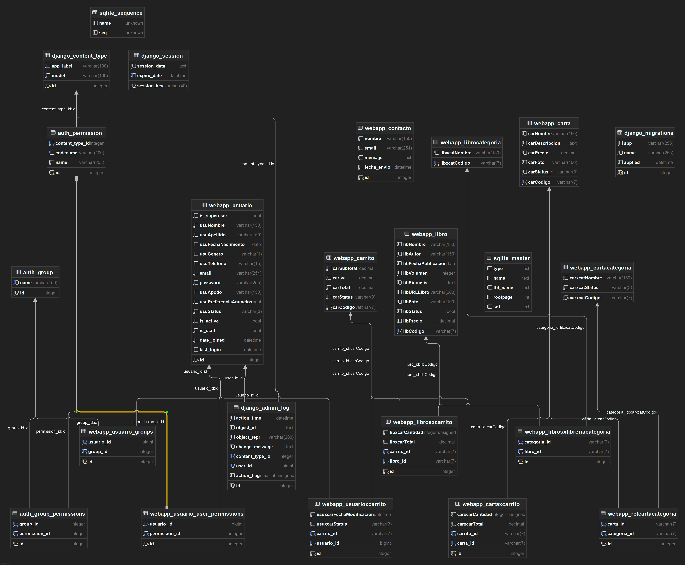
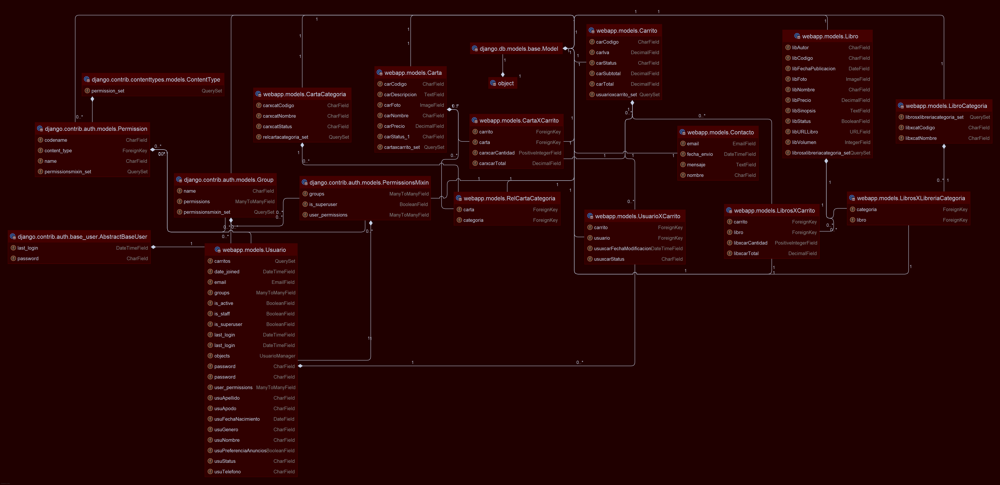
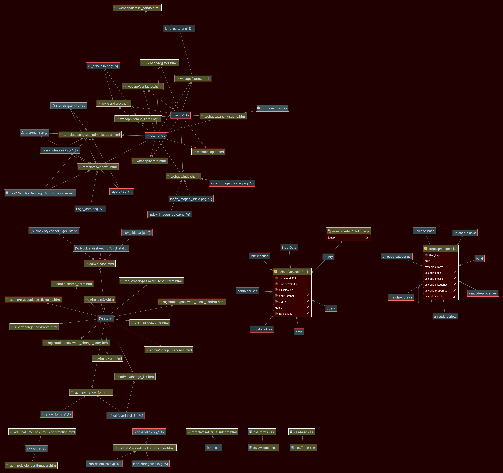

# ☕📚 **StandFree: Plataforma Web de Cafetería-Librería**

**StandFree** es una plataforma web que fusiona el ambiente acogedor de una **cafetería** con el mundo **literario**. Permite a los usuarios explorar productos gastronómicos y literarios, con un diseño atractivo y funcional. Está construida con tecnologías modernas como **Django** para el backend y **HTML5**, **CSS3** y **JavaScript** para el frontend.

---

## 🛠 **Descripción del Proyecto**  

StandFree permite a los usuarios explorar productos gastronómicos y literarios, integrando funcionalidades básicas de navegación, visualización de productos y un carrito de compras estático. El proyecto se centra en la creación de un prototipo funcional y escalable, con un diseño adaptativo que brinda una experiencia fluida en múltiples plataformas.

---

## 🌟 **Características Principales**

### 🎨 **Frontend**  
- **Interfaz visual dinámica:**
  - Diseño atractivo y consistente, basado en **HTML5** y **CSS3**.
  - Interacciones básicas con **JavaScript**, incluyendo un modo oscuro y modales interactivos.
- **Búsqueda de productos:**
  - Barra de búsqueda con filtros por nombre, precio o categoría.
- **Diseño responsivo:**
  - Adaptabilidad garantizada para dispositivos móviles y escritorios.

### ⚙️ **Backend**  
- **Framework Django:**
   - Creación y gestión de rutas y vistas dinámicas.  
   - Modelos de datos para libros, productos gastronómicos, categorías y carrito de compras.
- **Base de datos relacional:**
   - **SQLite** para desarrollo local (fácil de migrar a **PostgreSQL** o **MySQL**).
- **Integración dinámica:**
   - Conexión entre vistas y modelos para mostrar datos en tiempo real.

---

## 📂 **Estructura del Proyecto**

```plaintext
StandFree/
|
├── webapp/                       # Aplicación principal
|   ├── migrations/               # Migraciones de la base de datos
|   ├── static/                   # Archivos estáticos
|   |   ├── css/                  # Archivos de estilo CSS
|   |   ├── js/                   # Scripts JavaScript
|   |   ├── images/               # Imágenes del proyecto
|   |   ├── videos/               # Videos utilizados
|   ├── templates/                # Plantillas HTML
|   |   ├── base.html             # Plantilla base
|   |   ├── cartas.html           # Página de la carta
|   |   ├── libros.html           # Página de libros
|   |   ├── contacto.html         # Página de contacto
|   |   └── panel.html            # Panel de usuario
|   ├── models.py                 # Definición de modelos de la base de datos
|   ├── views.py                  # Vistas del proyecto
|   └── urls.py                   # Rutas de la aplicación
|
├── db.sqlite3                    # Base de datos SQLite
├── manage.py                     # Script de gestión de Django
└── README.md                     # Documentación del proyecto
```

---

## ✅ **Requisitos Previos**

- **Python**: Versión 3.9 o superior.
- **Pip**: Gestor de paquetes de Python.
- **Entorno virtual** (venv).

---

## ⚡ **Instalación del Proyecto**

### 1⃣ **Clona el Repositorio**
```bash
git clone https://github.com/usuario/StandFree.git
cd StandFree
```

### 2⃣ **Configura el Entorno Virtual**
```bash
python -m venv venv
source venv/bin/activate  # Linux/MacOS
venv\Scripts\activate     # Windows
```

### 3⃣ **Instala las Dependencias**
```bash
pip install -r requirements.txt
```

### 4⃣ **Configura la Base de Datos**
```bash
python manage.py migrate
```

### 5⃣ **Inicia el Servidor**
```bash
python manage.py runserver
```

**🔗 Abre tu navegador y accede a:** [http://127.0.0.1:8000/](http://127.0.0.1:8000/)

---

## 🧪 **Pruebas Realizadas**

- **Navegación:** Verificación de enlaces y botones interactivos.
- **Interactividad:** Funcionamiento de filtros y botones en secciones clave.
- **Responsividad:** Compatibilidad visual en dispositivos móviles y de escritorio.
- **Carga de Imágenes:** Optimización de tiempos de carga y tamaños.

---

## 🛠️ **Tecnologías Utilizadas**

### **Frontend**
- **HTML5**
- **CSS3**
- **JavaScript**

### **Backend**
- **Django Framework** (Python 3.9+)

### **Base de Datos**
- **SQLite** (desarrollo local)

---

## 🔮 **Próximos Pasos**

- Implementación de autenticación de usuarios.
- Funcionalidad completa del carrito de compras.
- Optimización avanzada de tiempos de carga y UX/UI.
- Migración de la base de datos a **PostgreSQL/MySQL** en producción.

---

## 📸 **Anexos**

| **Pantalla de Inicio**                                                                      | **Diagrama de Clases**                                                                 |
|--------------------------------------------------------------------------------------------|---------------------------------------------------------------------------------------|
|            |         |

| **Más Información**                                                                        |
|--------------------------------------------------------------------------------------------|
|  |

---

## 🤝 **Contribuciones**

¡Las contribuciones por el momento no estan disponibles !

---

## 📧 **Contacto**

- **Desarrollador:** Carlos Constante
---

## 📜 **Licencia**

Este proyecto está licenciado bajo la **MIT License**. Consulta el archivo `LICENSE` para más detalles.

---

🎉 ¡**Gracias por explorar la Biblioteca StandFree!** ☕📚
